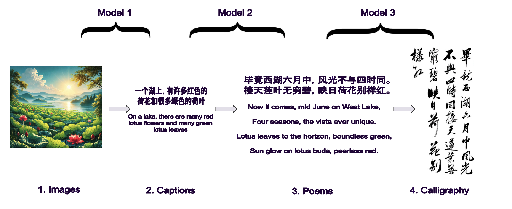
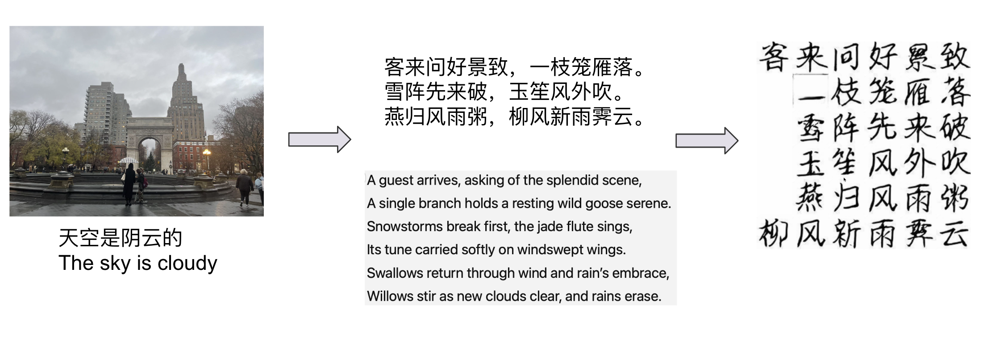
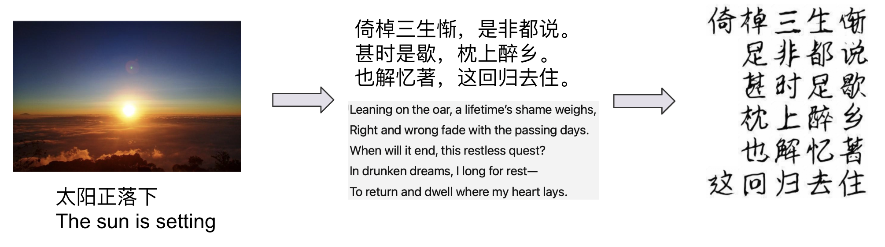
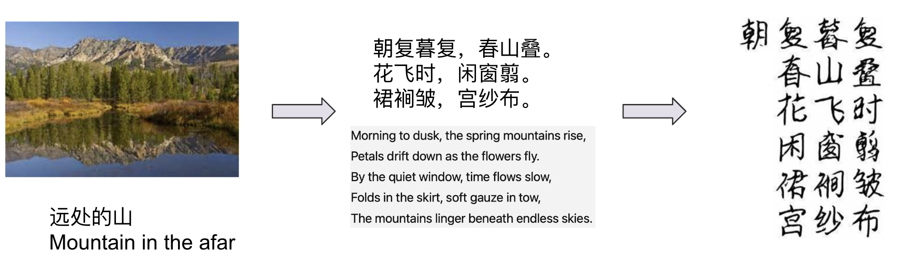
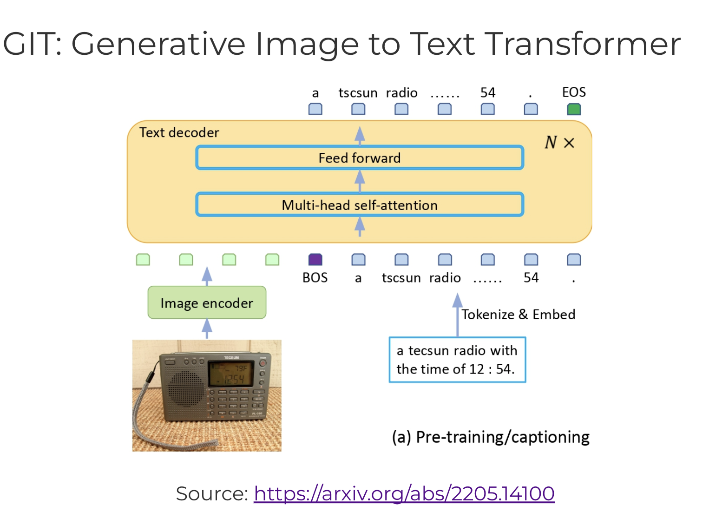
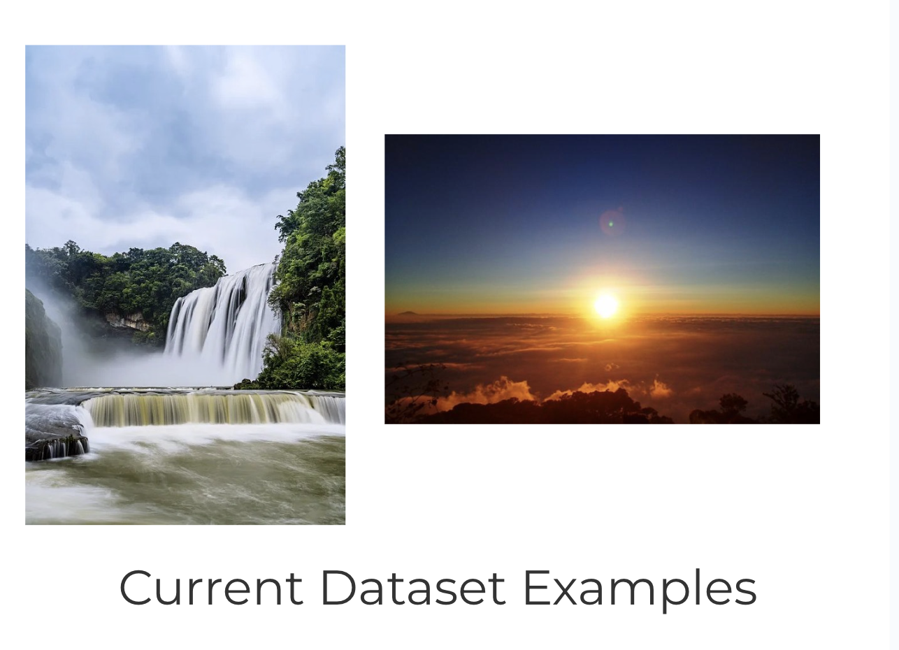
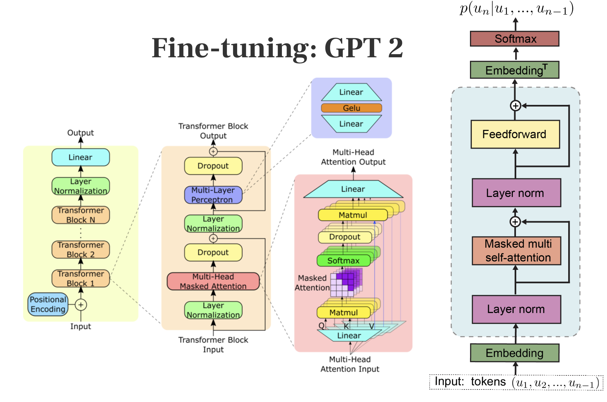
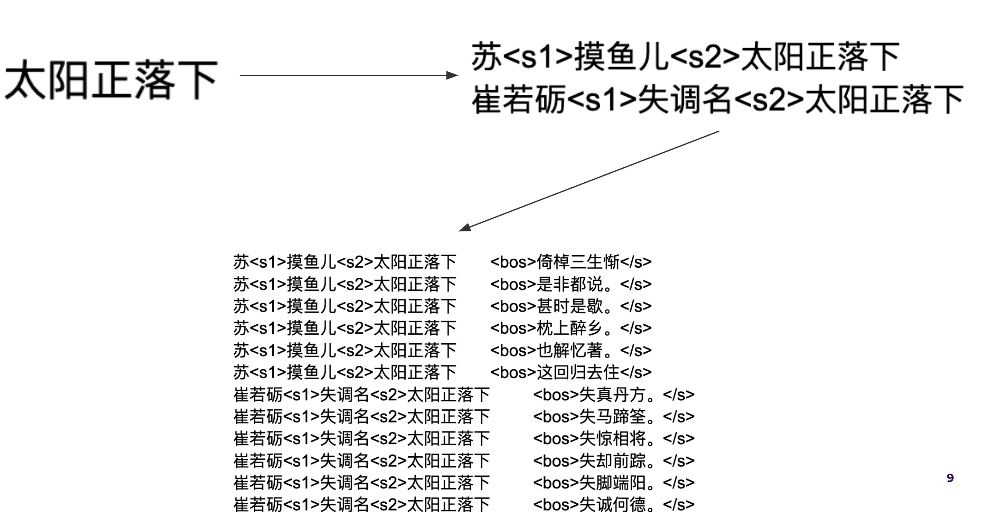
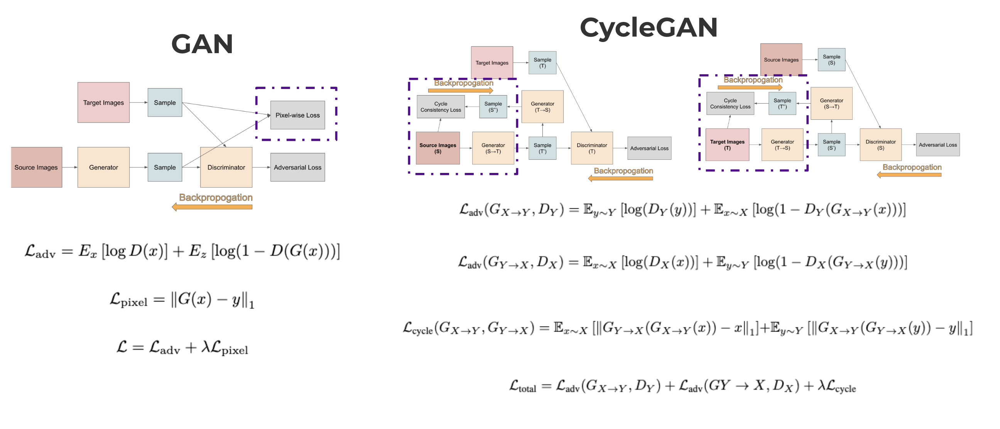
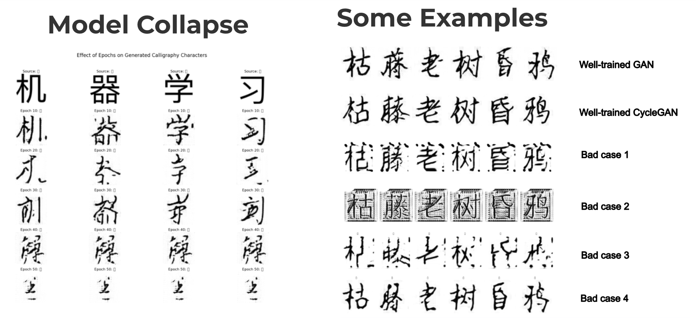

# DS-UA-301-AI-Calligraphic-Poet-Project

## Introduction

In this project, we combine photography, poetry, calligraphy into a unified application. The workflow can be summarized as follows: given an image, we will first generate captions describing the image. These captions are then used as inspiration to craft a poem. Finally, the poem is transformed into calligraphy. 

A diagram illustrating this process is shown below:

Some of our results are shown below:

Specifically our project contains the following three parts: 

### **1. Image Captioning**: 

In this part, we generate captions describing the main meessage in one input image. We fintune GIT model. Our main contribution is that we let the output language here to be Chinese. Additionally, we create out own dataset by integrating many datasets found on Kaggle, focusing on poem-related objects. 

More information about this part, in terms of data and model, can be found at the README in ``caption`` folder. 

### **2. Poem Generation**:

In this part, we generate poems based on the previous captions we get. We fine-tune the GPT2 model on Songci dataset. Our main contribution is that we deal with the constrained formatting in processing inputs. 

More information about this part can be found at the README in ``poem`` folder. 

### **3. Calligraphy Generation**:

In this part, we generate calligraphy works using the poem generated from the last step. We train GAN and CycleGAN model from scratch. Our main contribution is a rigorous discussion of the usefulness of CycleGAN model dealing with unpaired data, which really important in this specific calligraphy generation domain.

More information about this part can be found at the README in ``calligraphy`` folder. 