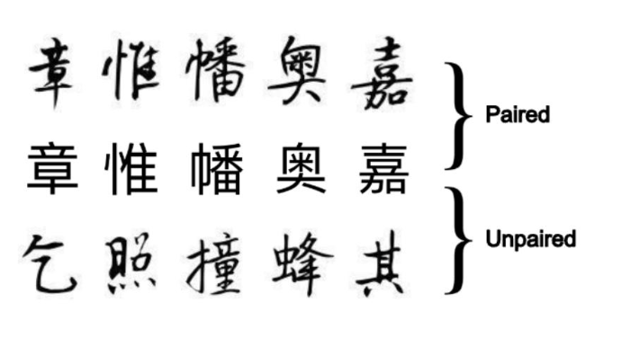
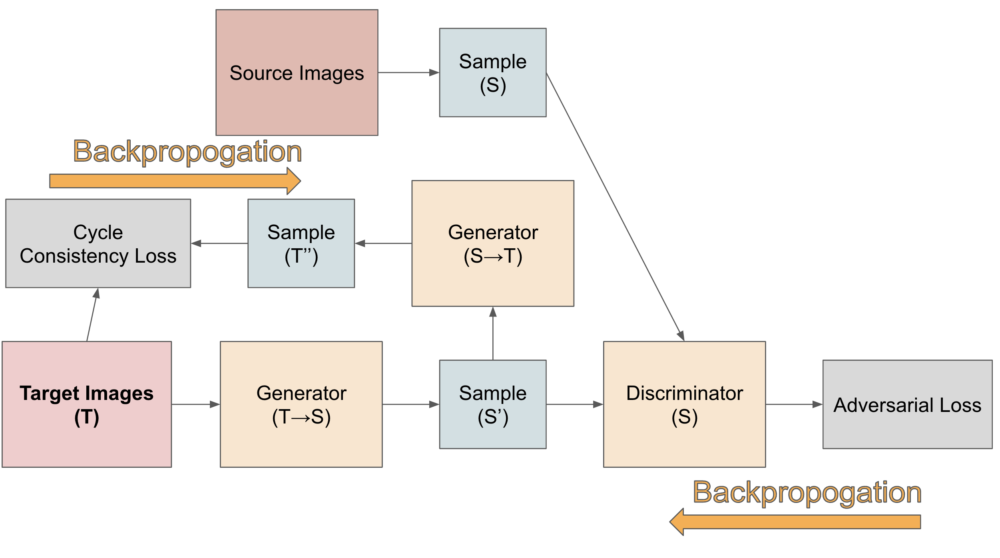

# Calligraphy Generation

## Data

**Source Font**: one can choose between the system font **normal_pingfang** or **normal_song**. The code to generate source font images are provided in ``generate_source_img.py``. The dataset we used, Chinese Calligraphy Styles by Calligraphers, can be found at https://www.kaggle.com/datasets/yuanhaowang486/chinese-calligraphy-styles-by-calligraphers/data. Though the source images should be generated by oneself. 

Dataset needed is varied for **GAN** and **CycleGAN** model:

1. **GAN:** we need **paired data**, one can run ``OCR_detector.py`` on their source folder and mannually check. Here we provide our checked of *bdsr* images in ``recognized_bdsr.txt`` in *mmanual_ocr* folder. 

2. **CycleGAN:** we only need **unpaired data**, here we don't need to worry about mannualy get paired data anymore, just use the kaggle dataset.

## GAN

One can train GAN model using ``train_GAN.py``. 

- **Loss Functions**: For loss function, we use both min-max adversial loss and pixel-wise loss. Adversial loss improves the authenticity, while the pixel-wise loss further help the model to learn strong feature representing the style. The formulas are stated as follows:

- **Generator**: There are three main parts in this block, we have a downsampling encoder, and *n* Dense Blocks with *n* can be defined, and a upsampling decoder. The aim for **DenseBlock** is to enhance feature extraction and prevent vanishing gradients. 

## CycleGAN

One can train CycleGAN model using ``train_cycleGAN.py``. 

- **Loss Functions**: The loss contains mainly two part. The fist part is adversial loss which are just similar to normal GAN. Cycle Consistency Loss is new here, it will enforce model to leaerning meaningful mapping but not generate random things to fool the Discriminator or the model collapse. This strong restrictions will make sure that model retain some meaningful informations and just based on that information to perform a style transform. Formulas are stated:

## Comparison

We use two standard evaluation metrics to evaluate different models:

1. **Consistent Score:** We trained a CNN-based classification model to differentiate between various calligraphy styles. After comparing several architectures, we selected DenseNet as the base model. The well-trained DenseNet model serves as a style-consistent feature extractor. To rigorously evaluate the model’s ability to learn styles, we calculate the cosine similarity between the generated images and the real images. You can train your own feature extractor in the *train_classifier* folder. The calculation function is stored in *utils* folder name ``calculate_style_consistency_score.py``. One can simply get the score by ``evaluate_style.py``.

2. **OCR Accuracy:** We use *easyocr* to recognize characters. After that we calculate accuracy score. The calculation function is stored in *utils* folder name ``OCR_detector.py``. One can simply get the score by ``evaluate_ocr_accuracy.py``. 

| Model      | Style Score | OCR Accuracy |
|------------|-------------|--------------|
| GAN        | 0.8790      | 68%          |
| CycleGAN   | 0.8732      | 69.2%        |